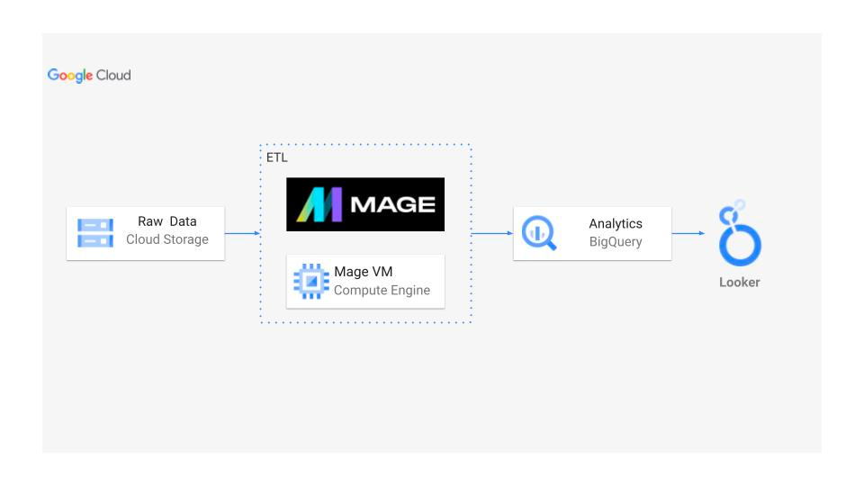
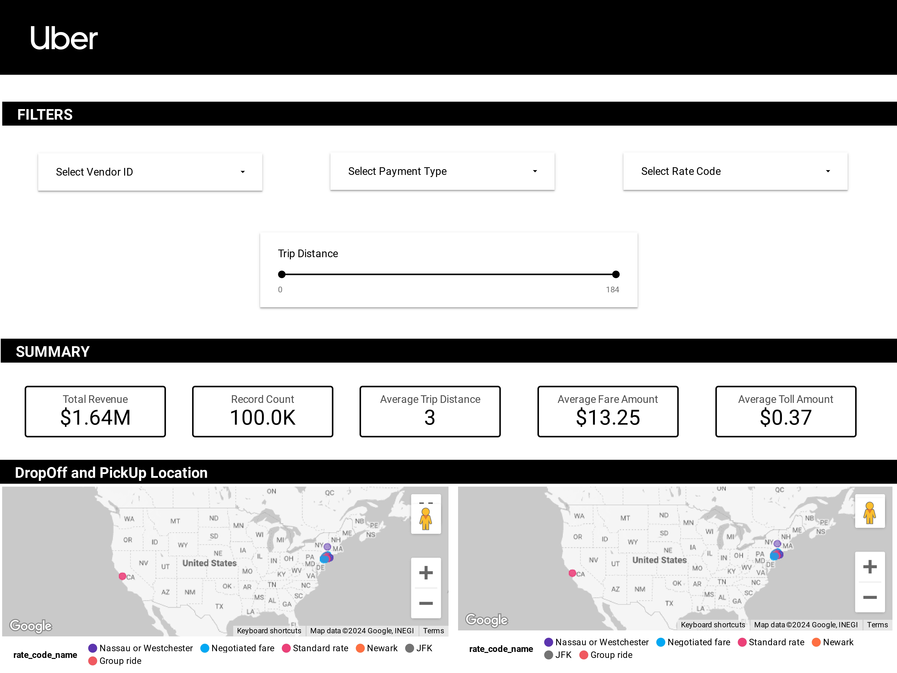
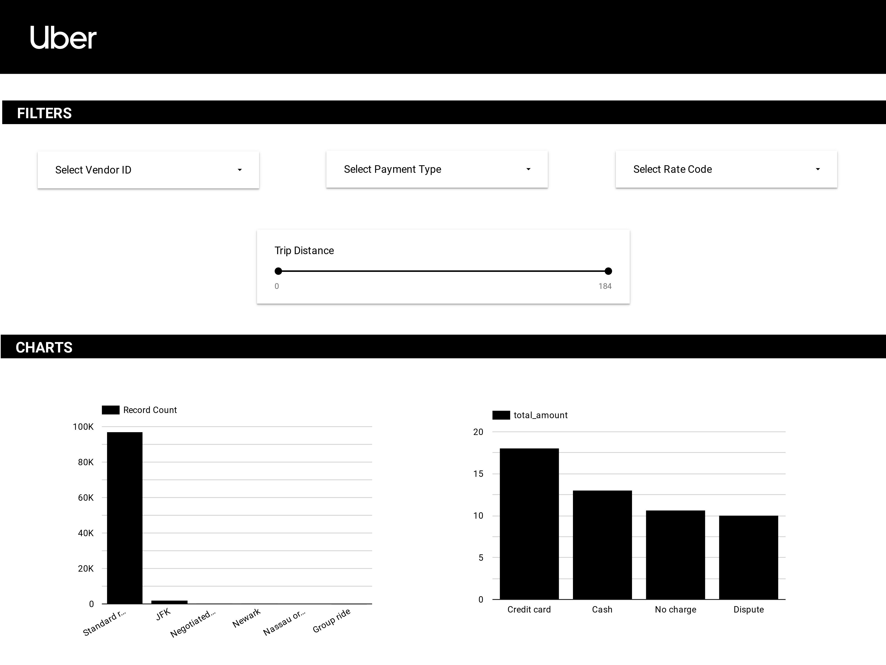

# Uber-ETL-Data-Project
Performed data analytics on Uber data using various tools and technologies, including GCP Storage, Python, Compute Instance, Mage Data Pipeline Tool, BigQuery, and Looker Studio.

## Architecture

## Technology Used
- Programming Language - Python
- Pipeline Tool - Mage-AI

Google Cloud Platform
1. Google Storage
2. Compute Instance 
3. BigQuery
4. Looker Studio

Modern Data Pipeine Tool - https://www.mage.ai/
Contribute to this open source project - https://github.com/mage-ai/mage-ai

## Dataset Used
TLC Trip Record Data Yellow and green taxi trip records include fields capturing pick-up and drop-off dates/times, pick-up and drop-off locations, trip distances, itemized fares, rate types, payment types, and driver-reported passenger counts. 

## Data Model

## UBER Dashboard

## Authors

* **Adnan Ali** - Project Lead & Main Contributor

As a Master's degree holder in Computer Science from UMass Boston, I have utilized my expertise in machine learning and computer vision to spearhead the development of this integrated model system. 
With a keen eye for innovative solutions, I have orchestrated the seamless fusion of posture analysis and logo detection models, showcasing state-of-the-art techniques in the realm of AI.

Connect :
- [GitHub](https://github.com/adi-tsvet)
- [LinkedIn](https://www.linkedin.com/in/adi-tsvet/) 

## References
1. Video tutorial - https://www.youtube.com/watch?v=WpQECq5Hx9g
2. GCP Account Tutorial - https://k21academy.com/google-cloud/create-google-cloud-free-tier-account/
3. Github project - https://github.com/darshilparmar/uber-etl-pipeline-data-engineering-project

